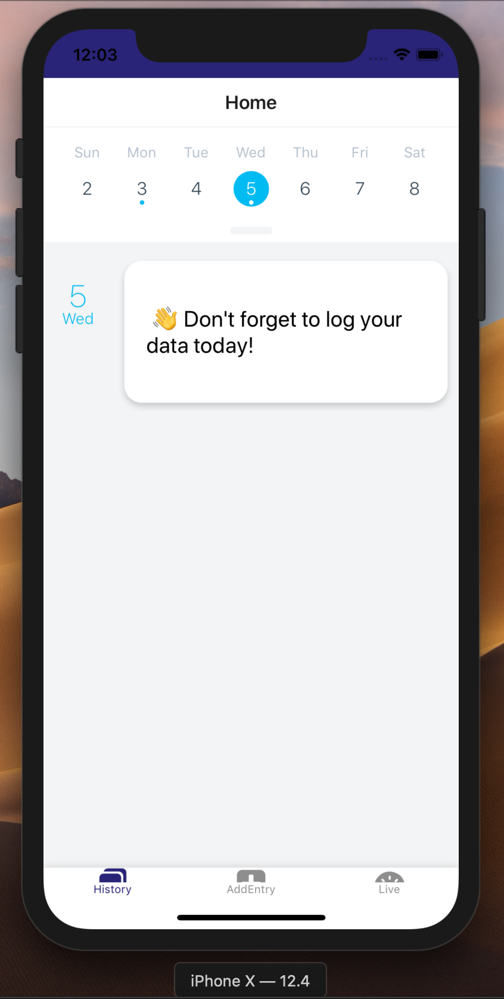
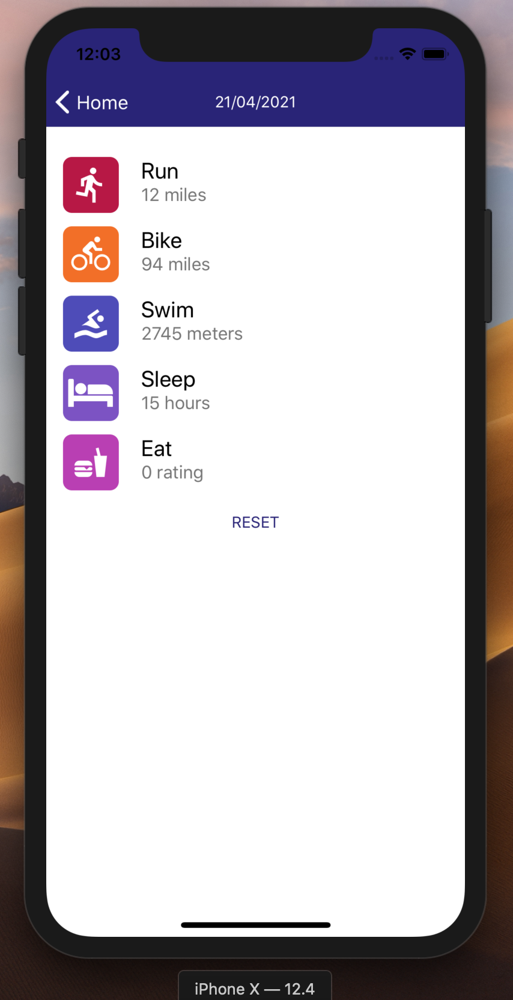
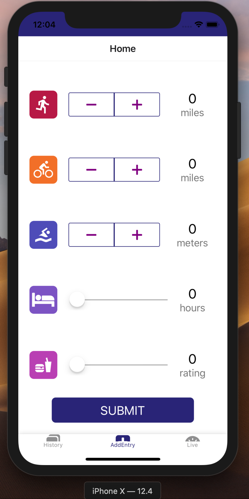
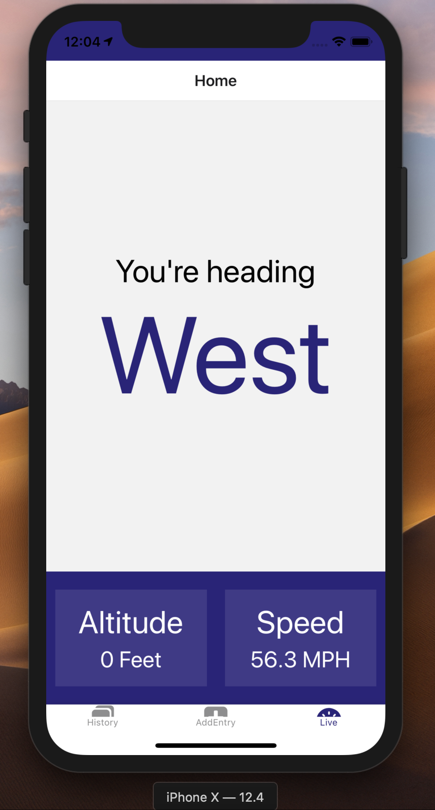

# UdaciFitness App
* App developed from in class lesson instructions as part of the Udacity's React Nanodegree program.
* App demonstrates React Native.

# Screenshots
|  |  |

|  |  |
|  |  |
|  |
